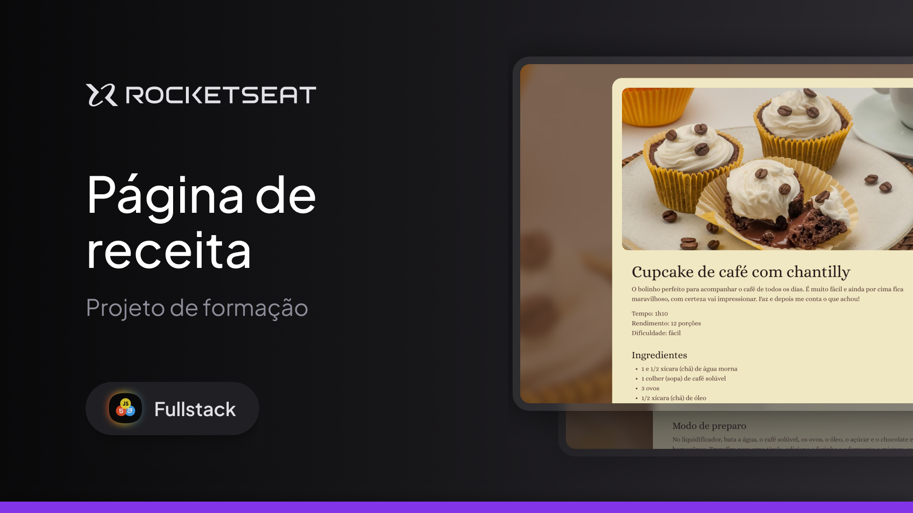

  

Projeto de Formação Fullstack.
Uma página de receita desenvolvida durante as aulas sobre Fundamentos do HTML e CSS na Rocketseat.

  <a href="#-tecnologias">Tecnologias</a>&nbsp;&nbsp;&nbsp;|&nbsp;&nbsp;&nbsp;
  <a href="#-projeto">Projeto</a>&nbsp;&nbsp;&nbsp;|&nbsp;&nbsp;&nbsp;
  <a href="#memo-licença">Licença</a>

  

 

  

## 🚀 Tecnologias

  

Nesse projeto desenvolvemos uma página de receita para um Cupcake de café com chantilly.